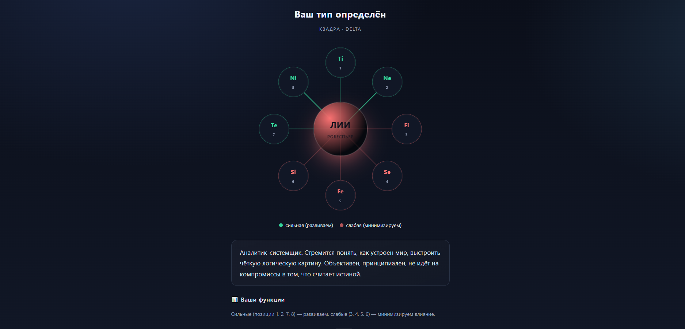

# Персональная диагностика личности на основе соционической типологии

Одностраничный веб-тест, который в два этапа определяет соционический тип пользователя (один из 16), выдаёт описание типа, орбиту функций, радар по уровням развития и план развития на 4 месяца.

## Возможности

- **Блок 1 — отсев по трём дихотомиям (9 вопросов):**
  - Шаг 1: I/E (интроверсия / экстраверсия) — 3 вопроса, остаётся 8 кандидатов
  - Шаг 2: S/N (сенсорика / интуиция) — 3 вопроса, остаётся 4 кандидата
  - Шаг 3: T/F (логика / этика) — 3 вопроса, остаётся 2 кандидата
- **Блок 2 — тонкое различение (7 вопросов)** под оставшуюся пару кандидатов:
  - 2 вопроса на первую релевантную пару функций (Ti/Te или Fi/Fe)
  - 2 вопроса на вторую релевантную пару (Ni/Ne или Si/Se)
  - 1 ассоциативный вопрос (по первой функции каждого кандидата)
  - 1 вопрос на болевую функцию
  - 1 вопрос на суггестивную функцию
- **Результат:**
  - Код типа (например, ЛИИ), полное название
  - Описание типа, источники стресса, сильные стороны
  - Таблица всех 8 функций с позициями и статусом (сильная / слабая)
  - Визуальная орбита функций с цветовой маркировкой по квадрам и анимацией связей
  - Радар-диаграмма на canvas по 8 осям (зелёный — сильные, красный — слабые)
  - План развития на 4 месяца
- **Дополнительно:**
  - Самооценка уровня функций (1–4) с построением радара
  - Возможность пропустить тест и выбрать тип вручную
  - Возможность пройти тест заново

## Для кого

- **Личное развитие** — понять свои сильные и слабые стороны, получить персональный план развития.
- **Бизнес и команды** — кадровикам, руководителям, HR: подбор ролей, распределение задач, снижение конфликтов.
- **Семья и отношения** — подбор партнёра, понимание совместимости, тип ребёнка и подходы к воспитанию.

## Технологии

- Чистый **HTML + CSS + JavaScript** (vanilla JS), всё в одном файле `index.html`
- **Canvas API** для радар-диаграммы
- **CSS-анимации** для орбиты функций, прогресс-кольца, нейрона
- Внешний скрипт `pdf_data.js` для генерации PDF
- Тёмная тема, CSS-переменные, адаптивная вёрстка
- SPA: переключение этапов через `display: none/block` без перезагрузки
- Данные — в оперативной памяти (объекты `allTypes`, `fnTraits`, `levelData`), без серверной части

## Как запустить

Это статический одностраничник. Достаточно открыть `index.html` в браузере. Никаких сборок, зависимостей и сервера не нужно.

## Состав репозитория

- `index.html` — сам тест, описание типов, орбита функций, радар, план развития
- `pdf_data.js` — данные для генерации PDF-отчёта
- `README.md` — этот файл

## Для разработчиков

В репозитории есть папка `.claude/skills/socionics-publish/` — это **ассистент-скилл для Claude Code**, который помогает работать с этим проектом (понимать структуру `index.html`, вносить правки, обновлять README, проверять ошибки, готовить релиз).

**Чтобы подключить скилл в Claude Code:**

1. Склонируйте или скачайте репозиторий (ZIP через кнопку на GitHub).
2. Скопируйте папку `socionics-publish` (из `.claude/skills/`) в свою локальную папку со скиллами:
   - **Windows:** `C:\Users\<ваше-имя>\.claude\skills\socionics-publish\`
   - **macOS / Linux:** `~/.claude/skills/socionics-publish/`
3. После этого в Claude Code скилл будет доступен автоматически — он подскажет, как устроен `index.html` (по строкам), где вопросы, как устроена логика теста, как делать релиз.

Содержимое скилла — это служебная документация для ассистента, она не влияет на работу самого теста.
